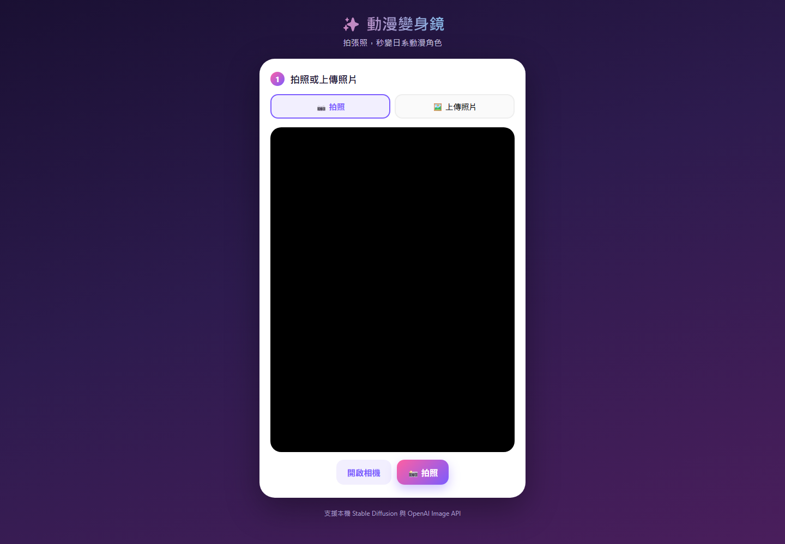

# 動漫變身鏡 · AI Photo Style

拍照或上傳照片，選擇少女漫畫、熱血少年、吉卜力或賽璐璐動畫風格，生成風格化圖片。

Capture or upload a photo and transform it with shoujo, shounen, Ghibli, or cel-animation style presets.

## 介面示意 · Interface preview



首頁提供相機拍攝與照片上傳兩種入口；完成取圖後即可選擇風格並送出生成。

The first step supports camera capture or photo upload. After selecting an image, choose a style and submit it for generation.

## 專案範圍 · Project scope

本倉庫專注於 AI 照片生成。峽谷選角機已移至獨立的 [wildrift-pick-analyzer](https://github.com/tzfei923-star/wildrift-pick-analyzer) 倉庫。

This repository focuses on AI photo generation. The Wild Rift picker now lives in the separate repository linked above.

## 本機啟動 · Local setup

需要 Node.js 20 以上。安裝套件、複製環境設定範例，再選擇生成後端。

Requires Node.js 20 or later. Install dependencies, copy the environment template, and choose a generation backend.

```powershell
npm ci
Copy-Item .env.example .env
npm start
```

開啟 <http://localhost:3000>。

Open <http://localhost:3000>.

### 本機 Stable Diffusion（預設） · Local Stable Diffusion (default)

```dotenv
GENERATION_BACKEND=local
SD_WEBUI_URL=http://127.0.0.1:7860
```

先啟動支援 `/sdapi/v1/img2img` 的 Stable Diffusion WebUI，並啟用 `--api`。此模式不使用 OpenAI 金鑰；啟動 Node 伺服器不會自動安裝或啟動模型。

Start a compatible Stable Diffusion WebUI with `--api`. This mode does not use an OpenAI key. Starting the Node server does not install or start the model service.

### OpenAI 後端 · OpenAI backend

```dotenv
GENERATION_BACKEND=openai
OPENAI_API_KEY=your-key-here
OPENAI_IMAGE_MODEL=gpt-image-2
```

目前預設使用 `gpt-image-2` 與 `/v1/images/edits`。金鑰只放在伺服器端的 `.env`，不要提交到 Git。每次生成會使用 API 額度。

The default is `gpt-image-2` through `/v1/images/edits`. Keep the API key in the server-side `.env` file and never commit it. Each generation consumes API usage.

## 網站與部署 · Website and deployment

[GitHub Pages 首頁](https://tzfei923-star.github.io/ai-photo-style/) 是專案說明頁。照片生成需要 Node 後端，無法只靠 GitHub Pages 執行。

The GitHub Pages homepage describes the project. Photo generation requires the Node backend and cannot run on GitHub Pages alone.

相機功能需要 `localhost` 或 HTTPS，以及瀏覽器授權。目前定位為本機工具；若要公開後端，需先加入存取控制與用量限制。

Camera capture requires `localhost` or HTTPS and browser permission. The current app is intended for local use; a public backend needs access and usage controls.

## 維護 · Maintenance

- `public/`：照片操作介面 / photo UI.
- `server.js`：生成 API 與後端選擇 / generation API and backend selection.
- `.env.example`：設定範例 / configuration template.
- `index.html`：GitHub Pages 專案說明頁 / Pages landing page.
- `public/wildrift/index.html`：舊網址轉址 / legacy redirect only.

一般修改應檢查照片上傳、風格選擇、錯誤訊息及舊網址轉址。有模型服務或 API 額度時，再驗證實際輸出。

For routine changes, verify photo upload, style selection, error messages, and the legacy redirect. Test real generation when a model service or API credits are available.

## 遷移紀錄 · Migration

2026-09-14：將選角機拆為獨立倉庫並保留來源目錄的 Git 歷史。原 Pages 首頁改為照片專案說明，舊 `/public/wildrift/` 與本機 `/wildrift/` 會轉至新選角機。舊版仍保留於 Git 歷史。

2026-09-14: The picker was extracted to a separate repository while preserving its directory history. The Pages root now introduces the photo project, and legacy picker routes redirect to the new app. Earlier versions remain in Git history.
